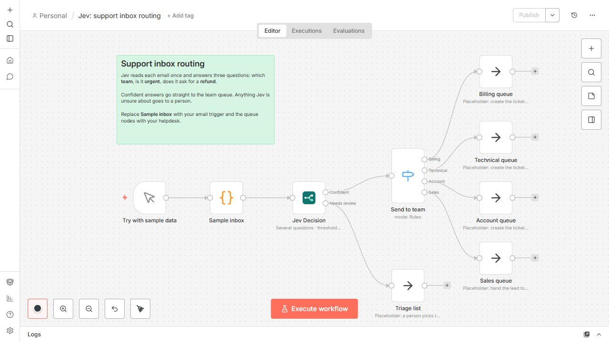
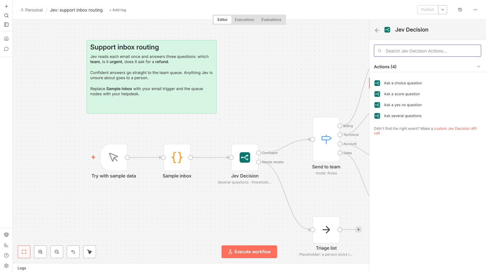
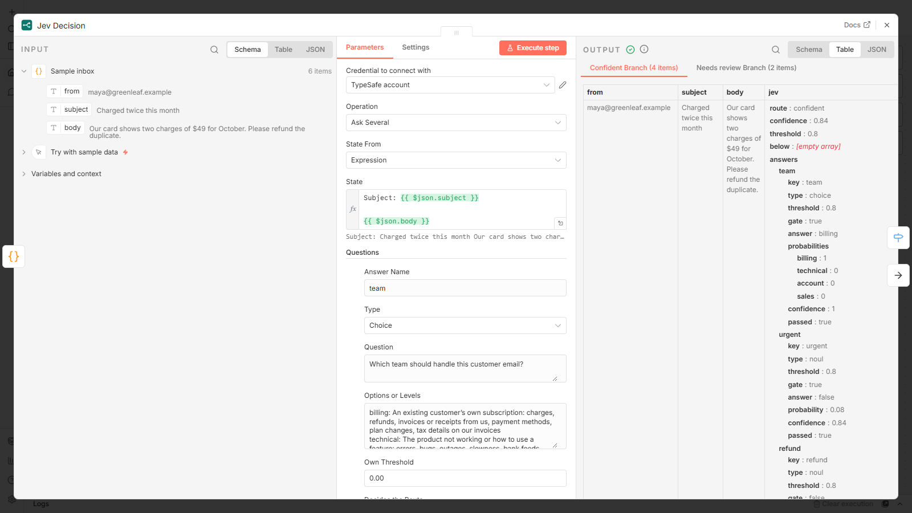
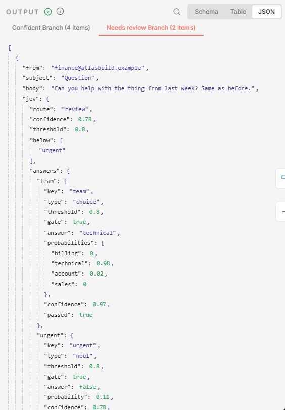
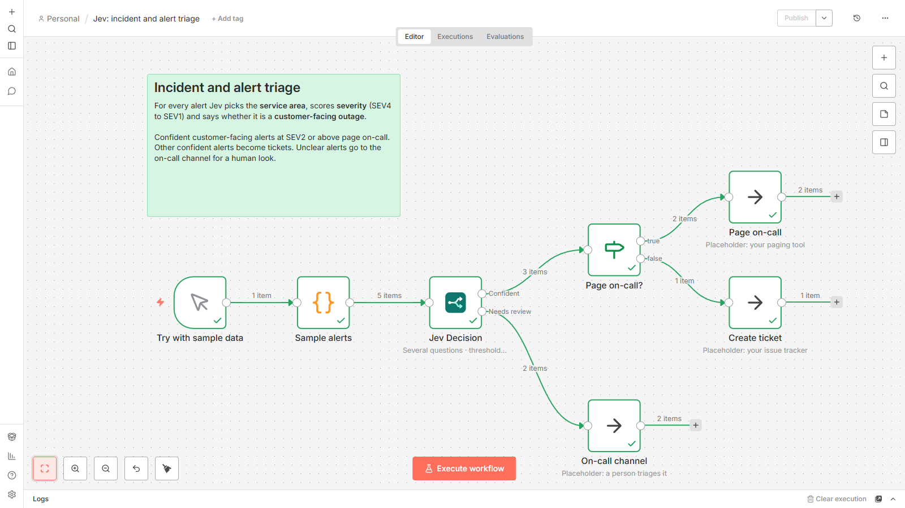
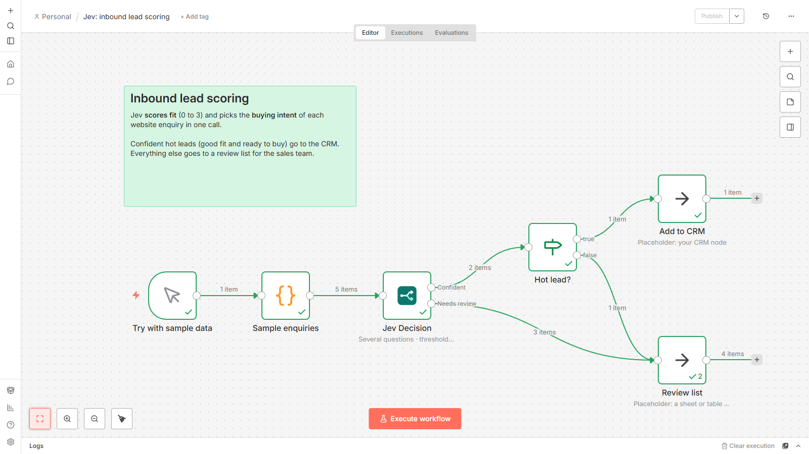
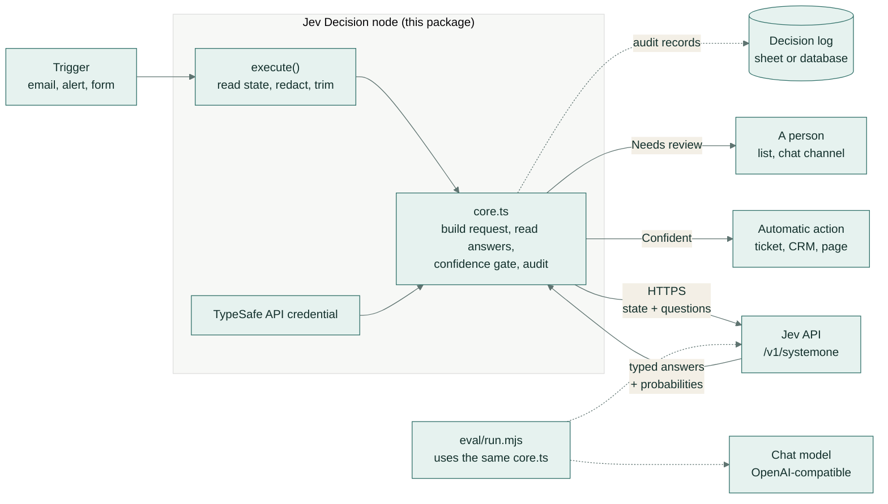
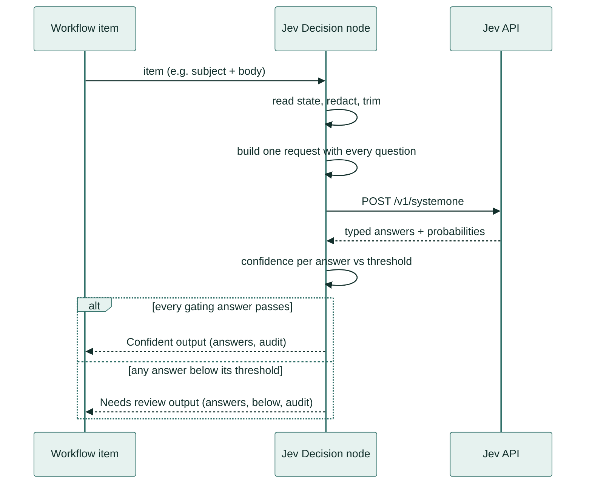
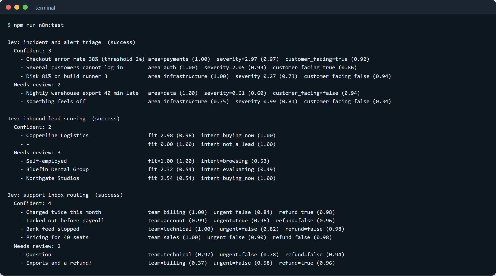
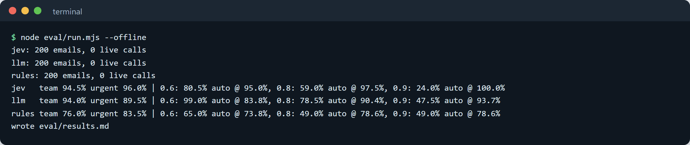

# n8n-nodes-jev: confidence-gated decisions for n8n

An n8n community node for **Jev**, TypeSafe AI's decision model. Ask a question about each item in a workflow and
get a typed answer with a confidence score. Items Jev is sure about carry on automatically; the rest go to a person.



*The support inbox example running in n8n. Six emails go in. Jev answers three questions about each one, sends four
straight to the right team, and holds back the two it is unsure about for a person to check.*

## What it does

It adds a "Jev Decision" step to n8n, the workflow automation tool. You tell the step what to decide, such as which
team should handle an email or how serious an alert is. It then sorts every item into two piles: "Confident", which
your workflow handles automatically, and "Needs review", which goes to a person. You choose how sure it has to be.

## A real-life example

**Nadia** leads customer support at Acme Software, a 40-person software company (a made-up business). About 120 emails
arrive every day, and someone reads each one just to decide where it goes: billing, technical, account access or
sales. They also have to spot the urgent ones. That sorting takes the first two hours of every morning, and urgent
emails still sit unread until somebody gets to them.

Nadia adds the Jev Decision step to the inbox workflow her team already runs in n8n. It answers three questions for
every email: which team, is it urgent, and does it ask for a refund. When Jev is confident, the ticket goes straight
to that team's queue, with urgent ones flagged. When it is not, the email lands on a short triage list for a person.

**After:** in our test on 200 support emails, Jev handled 59% of them on its own and got 97.5% of those right. For
Nadia's 120 emails, that means about 70 a day reach the right team within a second. At about a minute each to read
and route, that is over an hour of sorting saved every day. Her team only reads the 50 or so that are genuinely unclear. Each decision costs a fraction
of a cent.

## How you would use it

1. Ask whoever runs your n8n to install the node (one entry in n8n's **Community nodes** settings) and to add your
   TypeSafe API key as a credential.
2. Import one of the example workflows from the `workflows/` folder, or open a workflow you already have.
3. Add a **Jev Decision** step after the step that brings in your emails, alerts or form entries.
4. Type your question, for example "Which team should handle this email?", and list the possible answers with a
   short description of each.
5. Set how sure Jev must be before acting. 0.8 is a good start.
6. Connect the **Confident** output to the automatic action, such as creating a ticket, and **Needs review** to
   wherever a person will see it, such as a list or a chat channel.
7. Press **Execute workflow** and look at where each item went. Raise or lower the threshold until the split feels
   right.

## Screenshots



*Search "Jev" in n8n's node list. The node offers four actions: a choice from a list, a score on levels you describe,
a yes/no question, or several questions at once.*



*Inside the step: the emails coming in (left), the questions and answer options (middle), and the answers Jev gave
for the confident emails (right): team, urgency and refund, each with a confidence score.*



*The "Needs review" pile. The vague email "Can you help with the thing from last week?" was held back because Jev was
not sure enough about its urgency (`"below": ["urgent"]`), even though it guessed a team.*



*Alert triage for an engineering team: two confident customer-facing outages page on-call, a disk warning becomes a
ticket, and two unclear alerts go to the on-call channel for a person.*



*Lead scoring: one confident hot lead goes to the CRM; everything else goes to a review list for the sales team.*

This project is independent and not affiliated with TypeSafe AI.

---

## Key features

- **Two outputs, split by confidence.** "Confident" and "Needs review", with a threshold you set on each node and,
  when you need it, on each question.
- **Four operations.** Ask Choice, Ask Score, Ask Yes/No (Jev calls this a "Noul") and Ask Several, which sends
  several named questions about the same item in one request.
- **Typed answers.** A Choice returns the option name, a Score returns a number plus the most likely level, a Yes/No
  returns `true` or `false`, and each comes with its probabilities and a 0 to 1 confidence.
- **State from a field, an expression or the whole item.** "State" is Jev's word for the text it reads.
- **Audit records** for a decision log: question, answer, confidence, threshold, route, model version, timestamp,
  workflow and execution IDs.
- **Built-in redaction and length limits** so less data leaves n8n ([SECURITY.md](SECURITY.md)).
- **Parallel requests and retries.** Up to 20 items at a time, with automatic back-off when the API is busy.
- **Measured.** A labelled evaluation compares Jev with a general chat model and keyword rules, using the same
  request builder the node uses.

## Rolling it out to a team

1. **Start in the shadow.** Connect both outputs to the same review list for a week. Your team keeps working as
   before, and you can see what Jev would have decided.
2. **Count the mistakes in the Confident pile.** If the confident answers are almost always right, connect that
   output to the real action. If not, raise the threshold or sharpen the option descriptions.
3. **Write options the way you would brief a new colleague.** Say what belongs in each option and where the borders
   are ("refund requests go to billing even when the customer mentions a bug").
4. **Give risky actions a higher bar.** Use a higher threshold for anything that pages someone, spends money or emails
   a customer, and a lower one for tagging or sorting.
5. **Keep a decision log.** Turn on **Add Audit Record** and send the records to a sheet or database, so anyone can
   see later why an item went where it did.
6. **Review the "Needs review" pile now and then.** If the same kind of item keeps landing there, add an option for
   it or describe the existing options better.
7. **Decide what may be sent.** Read [SECURITY.md](SECURITY.md), send only the field you need, and turn on
   redaction for customer messages.

## How it works

For every item that reaches the node:

1. **Read the state.** The node takes the text from the field or expression you chose (or the whole item), then
   applies redaction and the length limit if they are switched on.
2. **Build one request.** The questions from the node's settings are checked (names, at least two options, two to
   ten levels) and turned into one Jev request: the state plus every question.
3. **Call Jev.** One HTTPS request per item, several items in parallel, authenticated with the TypeSafe API
   credential. A busy API (HTTP 429 or 529) is retried with back-off.
4. **Read the typed answers.** Each answer becomes a value plus a confidence between 0 and 1:
   - Choice and Score use the confidence Jev returns, which measures how far the top answer stands out from an even
     spread;
   - Yes/No has no separate confidence, so the node uses the distance from 0.5, scaled to 0 to 1 (`|2p - 1|`). A
     threshold of 0.8 means the probability must be at least 0.9 or at most 0.1.
5. **Gate.** Each answer is compared with its threshold (its own, or the node's). The item is Confident only if
   every question marked "Decides the Route" passes; otherwise it goes to Needs review, with the failing questions
   listed in `below`.
6. **Write the result** to the item under `jev` (or your chosen field), with the audit records if switched on.





## The node

| Setting | What it does |
|---|---|
| **Operation** | Ask Choice, Ask Score, Ask Yes/No (Noul) or Ask Several |
| **State From** | Field (a dotted path such as `email.text`), Expression, or Whole Item |
| **Answer Name** | The key the answer is stored under (single-question operations) |
| **Question** | What Jev should decide. Jev reads it literally, so be specific |
| **Options** / **Levels** / **Yes Means**, **No Means** | Choice options with descriptions; Score levels, lowest first (2 to 10); optional yes/no descriptions |
| **Questions** (Ask Several) | Each with a name, type, question, options or levels in a text box (`name: description` per line; `yes: ...` and `no: ...` for Yes/No), an **Own Threshold**, and **Decides the Route** |
| **Confidence Threshold** | The node's default threshold (0.8) |
| Options | **Add Audit Record**, **Redact Personal Data**, **Max State Length**, **Concurrent Requests** (default 5), **Model** (`jev-latest`), **Output Field** (`jev`), **Timeout** |

Output on an item from the support example run (Ask Several, audit records on; abridged: the refund answer, the
`key`/`gate` fields and two of the three audit records are left out):

```json
{
  "subject": "Locked out before payroll",
  "jev": {
    "route": "confident",
    "confidence": 0.96,
    "threshold": 0.8,
    "below": [],
    "answers": {
      "team": { "type": "choice", "answer": "account", "confidence": 0.99, "passed": true,
                "probabilities": { "billing": 0, "technical": 0.01, "account": 0.99, "sales": 0 } },
      "urgent": { "type": "noul", "answer": true, "probability": 0.98, "confidence": 0.96, "passed": true }
    },
    "model": "jev-1.13.0",
    "usage": { "input_tokens": 607, "output_tokens": 78 },
    "latencyMs": 278,
    "audit": [
      { "timestamp": "2026-10-09T10:11:11.913Z", "question": "team", "type": "choice",
        "instructions": "Which team should handle this customer email?", "answer": "account",
        "confidence": 0.99, "threshold": 0.8, "passed": true, "route": "confident",
        "model": "jev-1.13.0", "workflowId": "jevSupportRoute1", "executionId": "11" }
    ]
  }
}
```

The single-question operations also set `jev.answer` to the answer itself. With **Continue On Fail** switched on,
an item whose request fails goes to Needs review with `jev.error`.

## Example workflows

Importable JSON in [`workflows/`](workflows), each with invented sample data behind a **Try with sample data**
trigger and placeholder nodes where your own systems go.

| Workflow | Questions | Routing |
|---|---|---|
| [Support inbox routing](workflows/support-inbox-routing.json) | Choice: team. Yes/No: urgent. Yes/No: asks for a refund (recorded, not gating) | Confident: a Switch sends each email to its team queue. Needs review: triage list |
| [Incident and alert triage](workflows/incident-triage.json) | Choice: service area. Score: severity SEV4 to SEV1. Yes/No: customer-facing outage | Confident and customer-facing at SEV2 or above: page on-call; other confident alerts: ticket. Needs review: on-call channel |
| [Inbound lead scoring](workflows/lead-scoring.json) | Score: fit (0 to 3). Choice: buying intent | Confident, fit 2 or more and buying now: CRM. Everything else: review list |

The support workflow asks exactly the questions measured in the evaluation below (they come from
[`eval/questions.mjs`](eval/questions.mjs); `npm run workflows` regenerates the JSON).

All three were run in n8n 2.8.4 against the live Jev API from the command line (`npm run n8n:test`):



*Each workflow's items, the answers Jev gave with their confidence in brackets, and which output they reached.*

## Evaluation

[`eval/run.mjs`](eval/run.mjs) compares three ways of making the same two decisions on **200 invented support
emails**, each hand-labelled with a team (51 billing, 62 technical, 50 account, 37 sales) and whether it is urgent
(49 urgent). The emails include deliberate traps: a subject line saying "URGENT - not really", billing words in
technical problems, deadlines that are days away.

- **Jev**: the live API, with the node's own request builder (`jev-1.13.0`).
- **Chat model**: Gemini Flash-Lite through an OpenAI-compatible API, given the same instructions and options and
  asked for JSON with a stated probability.
- **Keyword rules**: the kind of IF/Switch logic a team writes by hand. The keyword lists were written with sight of
  the emails, so treat this baseline as optimistic.

**Headline: automation at a confidence threshold.** An email is handled automatically only when both answers reach
the threshold; everything else goes to a person.

| Backend | Automated @ 0.6 | @ 0.8 | @ 0.9 | Accuracy on automated @ 0.6 | @ 0.8 | @ 0.9 | Wrong let through @ 0.6 / 0.8 / 0.9 |
|---|---:|---:|---:|---:|---:|---:|---:|
| **Jev** | 80.5% | 59.0% | 24.0% | **95.0%** | **97.5%** | **100%** | **8 / 3 / 0** |
| Chat model (Gemini Flash-Lite) | 99.0% | 78.5% | 47.5% | 83.8% | 90.4% | 93.7% | 32 / 15 / 6 |
| Keyword rules | 65.0% | 49.0% | 49.0% | 73.8% | 78.6% | 78.6% | 34 / 21 / 21 |

Jev's confidence separates right from wrong answers: at 0.8 it lets through 3 wrong decisions out of 118 automated,
against 15 out of 157 for the chat model, which states high probabilities for answers that are wrong more often.
A 0.9 threshold on a yes/no answer needs a probability of at least 0.95 (or at most 0.05), which Jev gave for only
30% of the urgency answers, so a single 0.9 threshold holds most emails back. A threshold per question (team 0.8,
urgency 0.6) automates 74.5% at 96.0% accuracy, though that setting was picked after seeing these results.

| Backend | Team accuracy | Team macro-F1 | Urgent accuracy | Urgent F1 | Team Brier | Urgent Brier | Latency p50 / p95 | Cost per 1,000 emails |
|---|---:|---:|---:|---:|---:|---:|---:|---:|
| **Jev** | **94.5%** | **0.950** | **96.0%** | **0.925** | **0.095** | **0.034** | **235 / 716 ms** | **$0.025** |
| Chat model | 94.0% | 0.945 | 89.5% | 0.821 | 0.108 | 0.085 | 1,024 / 2,192 ms | $0.061 |
| Keyword rules | 76.0% | 0.749 | 83.5% | 0.727 | 0.384 | 0.132 | <1 ms | $0 |

- **Brier score**: the mean squared gap between the stated probabilities and what was true; lower is better.
- **Latency**: one request per email covering both questions, measured from the development machine.
- **Cost**: from the recorded token counts. Jev is priced at $0.042 per million input tokens with free output; the
  chat model at its list price.
- **Reliability tables**, per-question automation and token usage are in [`eval/results.md`](eval/results.md).



*The evaluation replaying the recorded answers, as CI does.*

**How it is measured.** Jev and the chat model were each called once per email (200 + 200 requests; Jev used 116,720
input tokens in total). Every response is recorded in `eval/cache/`, so `node eval/run.mjs --offline` reproduces
`eval/results.md` exactly without calling any API, and CI checks that it does.

## Install

The package follows n8n's community node format: TypeScript, the `n8n-nodes-` name, and an `n8n` section in
`package.json` that lists the node and credential.

**From the n8n UI.** In **Settings > Community nodes > Install**, enter `n8n-nodes-jev`. This needs the package on
the npm registry and an instance that allows community nodes.

**Manual install from a package file** (the same place the UI installs to):

```bash
npm ci && npm run build && npm pack                     # creates n8n-nodes-jev-0.1.0.tgz
cd ~/.n8n/nodes                                          # create it with "npm init -y" if it does not exist
npm install --legacy-peer-deps /path/to/n8n-nodes-jev-0.1.0.tgz
# restart n8n
```

**From a folder, with `N8N_CUSTOM_EXTENSIONS`** (handy for development):

```bash
npm ci && npm run build
N8N_CUSTOM_EXTENSIONS="$(pwd)/dist" n8n start
```

n8n names nodes loaded this way `CUSTOM.jevDecision` instead of `n8n-nodes-jev.jevDecision`, so import the example
workflows from the copies made by `npm run examples:custom` (written to `workflows/custom/`).

**Docker Compose** ([`docker-compose.yml`](docker-compose.yml)): n8n with the built node mounted read-only.

```bash
npm ci && npm run build && npm run examples:custom
cp .env.example .env                                     # set N8N_ENCRYPTION_KEY
docker compose up -d
docker compose exec n8n n8n import:workflow --separate --input=/workflows
```

Then open http://localhost:5678, create the owner account, and add a **TypeSafe API** credential with your key. The
credential test lists the available models, which costs nothing.

## Configuration

| Variable | Used by | Purpose |
|---|---|---|
| `TYPESAFE_API_KEY` | eval, `npm run n8n:test`, `npm run demo` | Jev API key. The test scripts import a credential that reads it as `{{ $env.TYPESAFE_API_KEY }}`, so the key is never written to disk |
| `AI_API_KEY` | eval | Key for the comparison chat model; without it the eval replays recordings only |
| `AI_BASE_URL`, `AI_MODEL` | eval | OpenAI-compatible endpoint and model (default: the Gemini API, `gemini-flash-lite-latest`) |
| `AI_MIN_INTERVAL` | eval | Seconds between chat-model calls (at least 2.5) |
| `N8N_BIN` | n8n scripts | Path to n8n's `bin/n8n` (otherwise `n8n` on the PATH) |
| `N8N_ENCRYPTION_KEY`, `GENERIC_TIMEZONE`, `N8N_VERSION` | Docker Compose | n8n settings |
| `N8N_URL`, `DOCS_KIT` | screenshots | Editor address and the screenshot toolkit folder |

In n8n itself the node needs only the credential: **API Key**, and **Base URL** if your organisation routes traffic
through a gateway.

## Development

```bash
npm run setup                   # install and build (dist/)
npm run demo                    # n8n editor on http://localhost:5691 with the node and the three examples loaded
npm run n8n:test                # run the three examples headless in a real n8n and print the routing
npm run check                   # build, lint, tests, and the offline evaluation (what CI runs)
npm run eval                    # re-run the evaluation; calls the APIs only for emails not recorded yet
```

`npm run demo` and `npm run n8n:test` use a throwaway n8n data folder (`.n8n-test/`). The demo signs in as the
owner account you create on first visit.

## Tests

`npm test` runs **25 tests** with Node's built-in test runner:

- the request builder, validation messages, the confidence formulas (checked against the examples in Jev's
  documentation), routing, audit records and redaction;
- the node's `execute()` against a stand-in for n8n's execution context: all four operations, the two outputs,
  per-question thresholds, Continue On Fail, retry on HTTP 429, item order with parallel requests;
- the evaluation metrics, the chat-model prompt and parser, the keyword baseline, and that every example workflow is
  wired correctly and asks the evaluated questions.

Lint: `eslint-plugin-n8n-nodes-base`, the rule set n8n applies to its own nodes. CI
([`.github/workflows/ci.yml`](.github/workflows/ci.yml)) runs build, lint, tests and the offline evaluation on every
push, and never calls a live API.

## Tech stack

| Part | Choice |
|---|---|
| Node | TypeScript 5.9, `n8n-workflow` as a peer dependency, n8n community node format |
| Workflow engine | n8n 2.8.4 (Manual Trigger, Code, Switch, IF, No Op) |
| Decision model | Jev (`jev-latest`, reported as `jev-1.13.0`) over plain HTTPS |
| Comparison model | Gemini Flash-Lite through its OpenAI-compatible API |
| Evaluation and tests | Node.js 22 scripts, `node:test` |
| Lint | ESLint 9 with `eslint-plugin-n8n-nodes-base` |
| Docs tooling | Playwright with Chromium for the screenshots and GIF |

## Project structure

```
n8n-nodes-jev/
├── nodes/JevDecision/
│   ├── JevDecision.node.ts     the node: settings, execute(), two outputs
│   ├── core.ts                 request builder, answer reader, confidence gate, audit, redaction (no n8n imports)
│   ├── JevDecision.node.json   n8n codex: category and links
│   └── jev.svg                 icon
├── credentials/
│   └── TypeSafeApi.credentials.ts   API key, Base URL, bearer auth, free credential test
├── workflows/                  the three example workflows (importable JSON)
├── eval/
│   ├── data/support-emails.jsonl    200 labelled invented emails
│   ├── questions.mjs           the support questions, shared with the example workflow
│   ├── backends/               jev, llm (chat model), rules, and the response cache
│   ├── cache/                  recorded API responses, replayed offline and in CI
│   ├── metrics.mjs             accuracy, F1, Brier, reliability, latency, automation rate
│   ├── run.mjs                 runs the comparison and writes results.md / results.json
│   └── results.md              the current numbers
├── scripts/                    build helpers, workflow generator, headless n8n runner, editor launcher, screenshots
├── test/                       node:test suites
├── docs/                       demo GIF and screenshots
├── docker-compose.yml          n8n with the node mounted
└── SECURITY.md                 what is sent to the API, redaction advice, key handling
```

## Licence

MIT. See [LICENSE](LICENSE).
